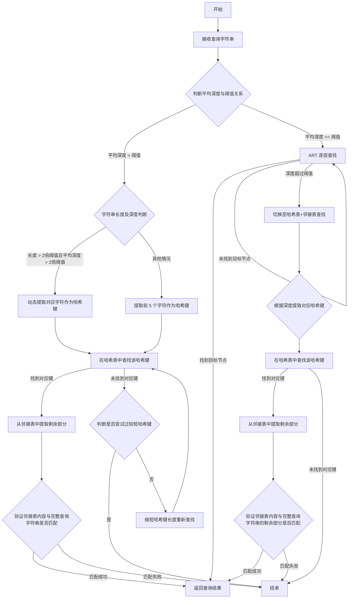

```mermaid
flowchart TB
    A[开始] --> B[接收查询字符串]
    B --> C{判断平均深度与阈值关系}
    
    C -->|平均深度 > 阈值| D{字符串长度及深度判断}
    C -->|平均深度 <= 阈值| E[ART 逐层查找]

    D -->|长度 > 2倍阈值且平均深度 > 2倍阈值| F[动态提取对应字符作为哈希键]
    D -->|其他情况| G[提取前 5 个字符作为哈希键]

    F --> H[在哈希表中查找该哈希键]
    G --> H

    H -->|找到对应键| I[从邻接表中提取剩余部分]
    H -->|未找到对应键| J{判断是否尝试过较短哈希键}
    
    J -->|是| K[结束]
    J -->|否| L[缩短哈希键长度重新查找]
    
    L --> H

    I --> M{验证邻接表内容与完整查询字符串是否匹配}
    
    M -->|匹配成功| N[返回查询结果]
    M -->|匹配失败| K

    E -->|找到目标节点| N
    E -->|未找到目标节点| E
    E -->|深度超过阈值| O[切换至哈希表+邻接表查找]

    O --> P{根据深度提取对应哈希键}
    P --> Q[在哈希表中查找该哈希键]

    Q -->|找到对应键| R[从邻接表中提取剩余部分]
    Q -->|未找到对应键| K

    R --> S{验证邻接表内容与完整查询字符串的剩余部分是否匹配}
    
    S -->|匹配成功| N
    S -->|匹配失败| K

```